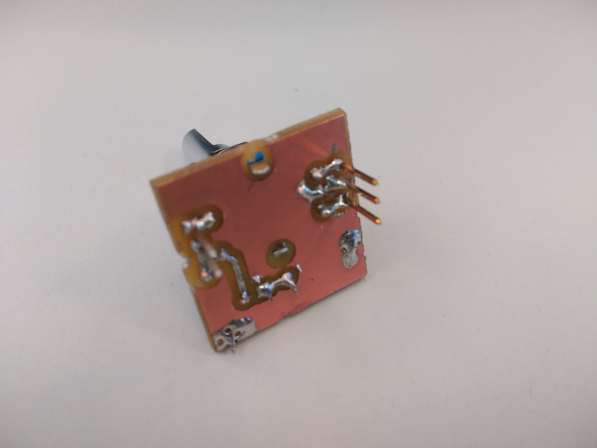
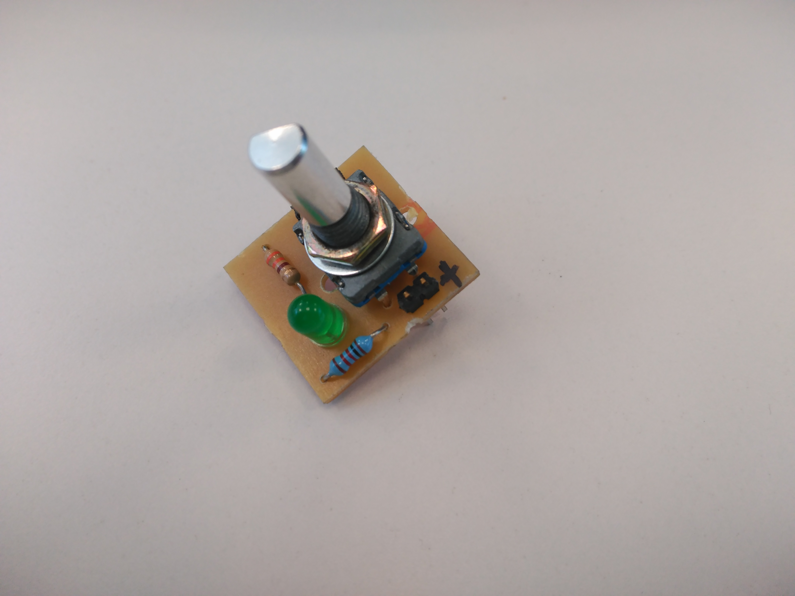

#EBA Encoder-Breadboard-Adapter

Are you mad of your encoder moving around your breadboard? This is for you! A single side Encoder breadboard adapter.

It have a hardware led to show when the pushbutton has been clicked.

##Pictures

